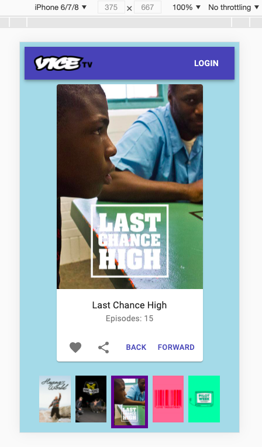

# VICE Front End Coding Exercise

Below is a HTML/CSS/JS exercise that involves building out a web component, or single page app, to navigate through various VICE shows.

- Use HTML5 semantic markup elements.
- Write your CSS using a preprocessor (Sass).
- Use React as your JavaScript library and try to avoid using Create React App.
- Add one or more unit tests using Jest or Mocha/Chai.
- Bonus: Use a module bundler or task manager such as Webpack to compile static assets. Along with this, include a linter for your code (ESLint, Prettier, ect.).

## Exercise
In index.html, rebuild the mocks in the designs folder in semantic HTML, CSS and JS. The designs represent layouts in a smaller screen and a larger screen. It is not 2 pages. Feel free to diverge from the designs and apply your own creativity. The goal is to build a simple UI that allows users to navigate between various shows while displaying the corresponding meta data for each.

## Specs:
- There are 10 shows, each with an id, title, episode count, and cover art. (see shows.json).
- Load the data using AJAX from `http://localhost:3000/shows` (you can start the server up using `yarn start-api`)
- When landing on the page initially, the first show should be selected.
- When clicking through the show selector the single show image, title, and episode count also updates.
- The url updates with the currently selected show. (http://{{page_url}}?id=b2, if second show is selected)
- A url with http://{{page_url}}?id=b2 should have the second show selected on page reload.
- When clicking between shows, hitting “Back” and “Forward” on the browser will also update the url, cover image, title, and episode count according to the show id.
- The minimum width of the screen is 320px. The horizontal breakpoint is at 980px. Build with a mobile first approach.

# To install:
```
1. clone the repo
2. run npm install
```

# To start the servers
to start front-end server (react):
```
export NODE_ENV=development
npm run start
```
to start back-end server (node):
```
nvm use 12.14.1
yarn start-api 
```
# To run locally:
```
http://localhost:8080/
```
# Screen shot of completed project as mobile website
# 